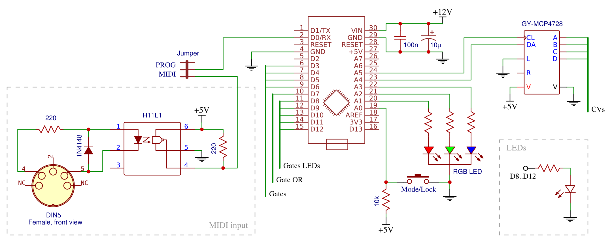

MIDI 4+1
========

A DIY Arduino-powered MIDI to 4x CV/gate interface in 6 HP, with both polyphonic and monophonic voice allocation modes.

**[Arduino code][1]** | **[BOM][2]** | [🛒 **Buy PCB and panel on Tindie**][7] | **[ModularGrid][6]** | **[YouTube demo][5]** | [🗨️ **Mod Wiggler**][3] | [🗨️ **Lines**][4]

[1]: midi4plus1.ino
[2]: midi4plus1-bom.csv
[3]: https://www.modwiggler.com/forum/viewtopic.php?t=231861
[4]: https://llllllll.co/t/midi-4-1-arduino-powered-polyphonic-and-monophonic-midi-to-4x-cv-gate-interface-in-6hp/32543
[5]: https://youtu.be/g9WwDo7eYi4
[6]: https://www.modulargrid.net/e/joeseggiola-midi-4-1
[7]: https://www.tindie.com/products/joeseggiola/midi-41-a-4x-cvgate-interface-pcb-panel/

Features and limitations
------------------------

* Single MIDI input via DIN or [TRS Type A](https://www.midi.org/midi-articles/trs-specification-adopted-and-released) (now the MIDI standard).
* Four 1V/oct CV/gate outputs with gate LEDs.
* Button for cycling through five different modes, with coloured mode LED:
   * **Poly** (red): four-voices polyphony with priority to last, LRU strategy and voice stealing;
   * **Poly-first** (green): four-voices polyphony with priority to first and first-available strategy;
   * **Split poly+mono** (blue): split keyboard with three-voices polyphony on the left, and monophony on the right (priority to last);
   * **Split mono+poly** (pink): same as above, but flipped;
   * **Mono** (teal): four independent monophonic allocators, one for each MIDI channel 1 to 4.
* Additional output which can work as one of the following:
   * Gate output that stays high while at least one polyphonic voice is active (logic OR), useful for single-filter setups;
   * Trigger output for MIDI clock, with customizable PPQ (can be enabled [in code](midi4plus1.ino#L23)).
* Voices lock with a long-press of the mode button: all gates of currently held polyphonic voices stay high, ignoring key releases until next reallocation.

The DACs range is 0-4V, so only the 4 center octaves are covered. The get more, it is necessary to add amplifiers 
on CV outputs. Split modes splits the keyboard on middle C. Both lowest MIDI octave and split octave are easily
configurable in code.

Uploading a new sketch requires disconnecting the MIDI input circuit from the Arduino RX pin: there's a jumper on the back of the PCB that can be moved from "MIDI" to "PROG".

### Calibration procedure

Power on your modular system with the button pressed: the mode LED lights up in white to show you entered the DACs calibration procedure. Gate LEDs show which CV output is currently being calibrated. The procedure requires measuring the output voltage using a multimeter with mV precision (0.001V).

The first CV output should be around 0.5V: use a MIDI instrument to send any note below C4 to decrease the measured value, or any note above C4 to increase it, until you get exactly 0.500V. Now press the button to advance to the next calibration point, that is 1.000V, and adjust the measured value again. There are 8 calibration points for each CV output (configurable in code), after which the calibration process is repeated for the second, third and fourth CV output, as shown by gate LEDs.

At the end of the whole procedure, the module will reboot itself and all CV outputs will track 1V/oct accurately. Calibration data is stored in Arduino EEPROM memory, so it's persisted across reboots and won't be lost by uploading a new sketch.

Schematic
---------

Pictures
--------

### New [PCB](pcb/) build

[🛒 **Buy PCB and panel on Tindie**][7]

  

### Old [3D-printed](3d/) build

 

Thanks
------

- Emilie Gillet's [CVpal][10] (polyphonic voice allocator, monophonic notes stack, calibration)
- Befaco [MIDI Thing][11] (form factor, calibration)
- François Best's [Arduino MIDI Library][12]

[10]: https://github.com/pichenettes/cvpal
[11]: https://github.com/Befaco/midithing
[12]: https://github.com/FortySevenEffects/arduino_midi_library
